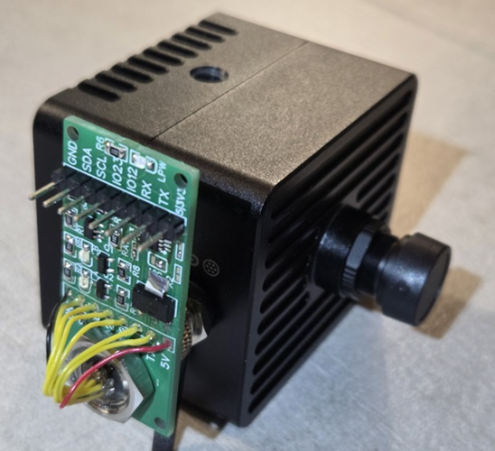
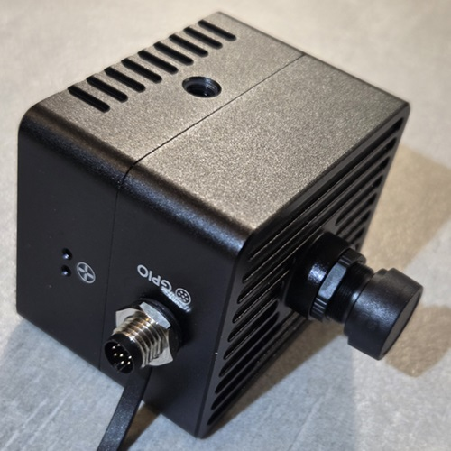

# qbastrial_hwtest
QB-ASTRIAL camera testing procedure

|  |  |

## requirements
You will need a Ubuntu linux PC with at least one spare eth port, one PoE ethernet switch, the QB-ASTRIAL camera.
You will need a USB-TO-SERIAL adapter for 3.3v level to connect to the camera via serial port.
You will also need the special "testing dongle" to be connected to the camera via the M8 gpio expander port.
See the docs folder for schematic.

## testing setup
Your pc ethernet port must be configured for FIXED ip_addr of 10.0.0.1/24.
Connect the camera to the switch via ethernet cable, connect the pc to the same switch. 
Do not connect the switch to any other external network, it should be a private (isolated subnet)

Connect the dongle to the camera and connect the USB-TO-SERIAL adapter to the dongle, using GND/TX/RX pin.

## startup
On your linux PC install Putty (sudo apt install putty) and connect via serial port to the camera, using the default speed of 115200 N 1.
Open a command shell (bash) on your PC, enter the qbastrial_hwtest and launch the streaming client:

```
./qb-astrial_streaming_client.sh
```

Now open a separate command shell, enter the qbastrial_hwtest folder and launch the testing script.

```
./runme.sh
```

Follow instructions on the screen to proceede with all the testing steps until the procedure is successful.

